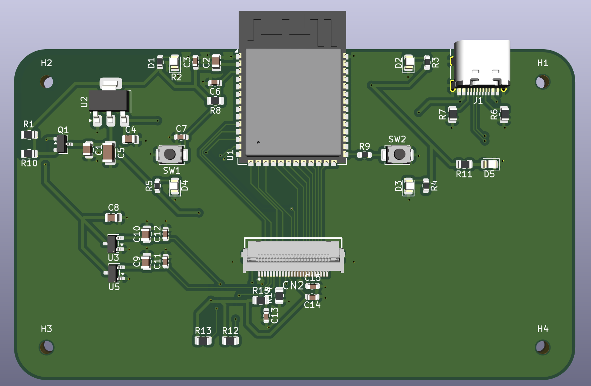
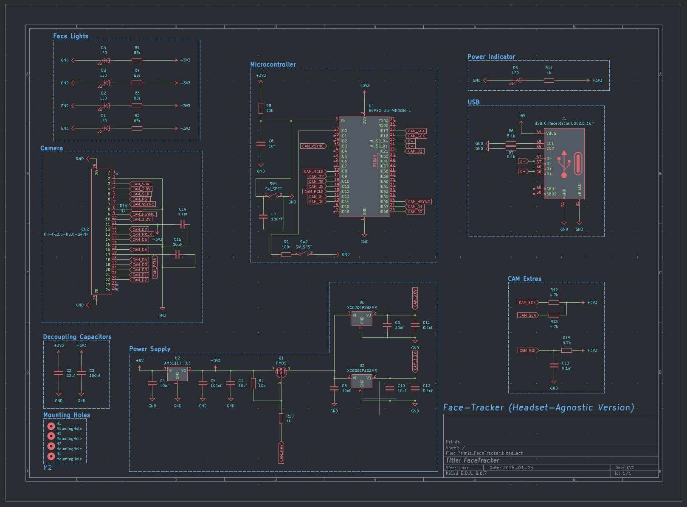
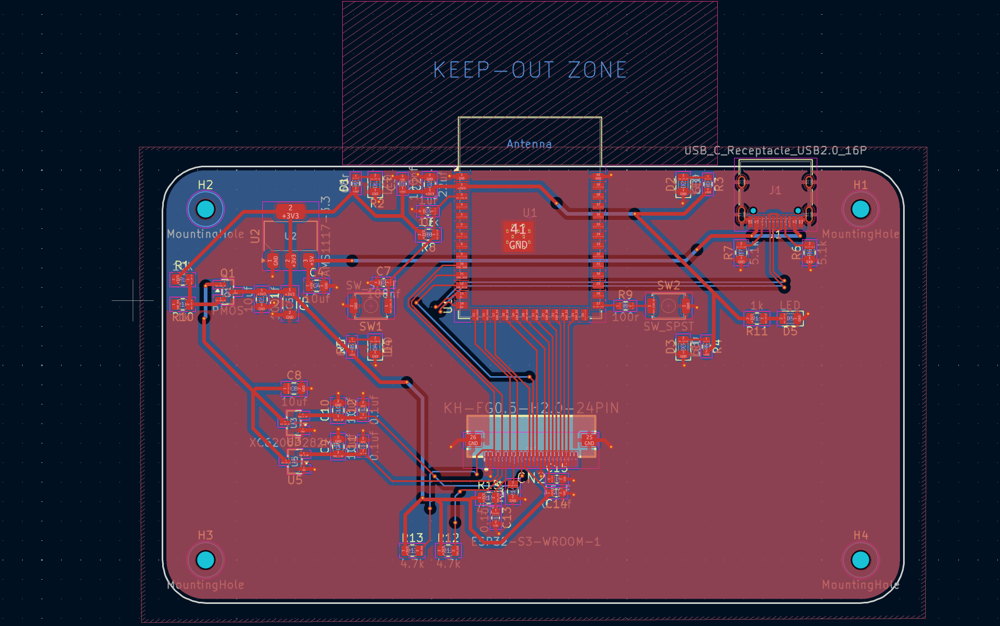

### WARNING
This has yet to be produced by me yet, I have not yet added the gerber files to this repo yet as I have no idea if it will work yet, order them at your own risk.
# Face Tracker (Headset-Agnostic Version)
Headset-agnostic face tracker. Can be used with Frame by using the USB-C port on the battery.

  

### Schematics

  

### PCB

  

