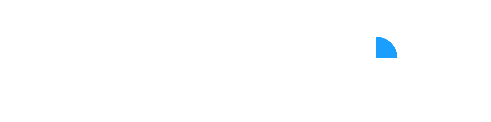

## Note
A forewarning, I am very new to electronics design in general I apologize in advance for any really baffling design decisions. I hope to learn using these projects and will keep them updated as I learn more. Thank you for your patience.

  

# What is FrameWork?
FrameWork is intended to be a open source bundle of different hardware peripherals built around (but not always exclusive to) the steam frame. The idea is to leverage the steam frames modularity and general open nature to create a collection of open source hardware projects that the community can give feedback to, expand upon, or even take and make something entirely new creating a feedback loop to add to an ever expanding ecosystem for the steam frame. All source files will be included from PCB schematics to STLs allowing every aspect of each project to be modified and then produced to anyone’s preferences. 

## Hardware
Below is a list of all currently in development hardware projects which will include a brief overview and notes on changes made to the most recent revision.

### Frame Facetracker
The frame face tracker is pretty self explanatory, it is a module that will use a camera for face tracking in social experiences like VRChat. There are 2 versions planned, one built with the steam frame in mind that will use the steam frames expansion ports and another that will instead plug into the back USB port of the frame that uses a esp32 for running the camera.

### Versipellis (General Purpose Dongle)
Versipellis is a dongle utilising a nRF52833 that is intended to be a general purpose dongle for talking to any frame based hardware, whether it be controllers or trackers. It will be programmable by the end user for whatever they intend on using it for. There will be two versions, one utilising no parts smaller then a 0603 package making it easy to hand assemble, and another using much smaller parts that while being smaller will require you to have it assembled by a service like JLCPCB.

### Locus (Tracker)
Locus is intended to be a tracker like Vive or Tundra trackers but without reliance on lighthouse base stations for tracking. Since the steam frame isn’t limited to base station vision trackers being used with it shouldn’t be either. Similar to Versipellis Locus will also use a nRF52833 along with a LSM6DSV16X IMU and a QMC6309 magnetometer. The idea is it will track similar to that of a slime tracker but also using the steam frames optical tracking as a way to solve the drift problem of EMF trackers. 
