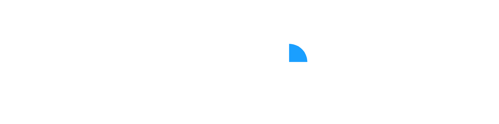

## Note
A forewarning, I am very new to electronics design in general. I apologize in advance for any really baffling design decisions. I hope to learn from these projects and will keep them updated as I learn more. Thank you for your patience.

> ⚠️This is an unofficial 3rd-party project with no association to Valve.

  

# What is Frame Workshop?
Frame Workshop is intended to be an open-source bundle of different hardware peripherals built around (but not always exclusive to) the Steam Frame. The idea is to leverage the Steam Frames' modularity and general openness to create a collection of open-source hardware projects that the community can provide feedback on, expand upon, or even take and turn into something entirely new, creating a feedback loop that adds to an ever-expanding ecosystem for the Steam Frame. All source files, from schematics to STLs, will be included, allowing every aspect of each project to be modified and produced to anyone’s preferences. 

## Hardware
Below is a list of all currently in development hardware projects, including a brief overview and notes on changes made to the most recent revision.

### Frame Facetracker
The Frame face tracker is pretty self-explanatory: it is a module that uses a camera for face tracking in social experiences like VRChat. There are 2 versions planned: one built with the steam frame in mind, using its expansion ports, and another that plugs into the back USB port of the frame and uses an ESP32 to run the camera.

Link to the facetracker files:
https://github.com/Nieko27/FrameWork/tree/main/KICAD%20Projects/Primis_FaceTracker

### Versipellis (General Purpose Dongle)
Versipellis is a dongle utilising an nRF52833 intended as a general-purpose dongle for communicating with any Frame-based hardware, whether it be controllers or trackers. It will be programmable by the end user for whatever they intend to use it for. There will be two versions: one utilising no parts smaller than a 0603 package, making it easy to hand-assemble, and another using much smaller parts that, while smaller, will require assembly by a service like JLCPCB.

Link to Versipellis' files:
https://github.com/Nieko27/FrameWork/tree/main/KICAD%20Projects/Primis_Versipellis

### Locus (Tracker)
Locus is intended to be a tracker like Vive or Tundra, but without reliance on lighthouse base stations. Since the Steam Frame isn’t limited to base station vision, trackers being used with it shouldn’t be either. Similar to Versipellis, Locus will also use an nRF52833 along with an LSM6DSV16X IMU and a QMC6309 magnetometer. The idea is that it will track similarly to a slime tracker, but also use the Steam Frame’s optical tracking to address the drift problem of EMF trackers. 

Link to Locus' files:
https://github.com/Nieko27/FrameWork/tree/main/KICAD%20Projects/Primis_Locus

## Project Goals

* Keep costs to the users as low as possible. You've probably already spent close to $1000 on the headset itself, so it would be nice not to have to spend another $1000 customizing it to your liking. How this would be achieved is by everything being open and nothing being sold, for example I’m working on a face tracker that takes advantage of the PCIe port on the Frame, the idea is when its done instead of me having to handle production, shipping and all the joys of selling a project I give the source files out with a tutorial on how to order it yourself from a company like JLCPCB. Now, obviously, this still won't be free to the end user, but it will be much cheaper than if I were to sell it. For example, I have made the first prototype of the face-tracker, and in small quantities (5 to be exact), it cost me $25 per board. Compare that to something like the old Vive face trackers, which I think were closer to $100, and you save a nice bit of money. 

* Give the end user total control over the hardware. Don't like how I've done something? Fire up Blender or KiCad and change it yourself to fit whatever need you have in mind. I know not everyone will be able to do this, as it requires familiarity with the software, but it gives people the ability to do so. Obviously, with this in mind, I want to make the experience for everyone as smooth as possible out of the box, so I will be listening to feedback as much as possible to achieve that. 

* Create a feedback loop. I have all this under a CERN-OHL-S-2.0 license, which (as far as I understand) means you can do anything you want with anything in the repo, including selling it for profit, but you must open-source anything you do under the same license. This way it keeps everything open to the community, and every addition helps grow the ecosystem around the Steam Frame. 

## Ideas
A few ideas for possible mods for the Frame have already been thrown around. If you have an idea for a mod, whether it's a full module or as simple as a 3D-printable counterweight, feel free to open a pull request under the enhancement tag. You may also feel free to email me at nieko972@gmail.com.
